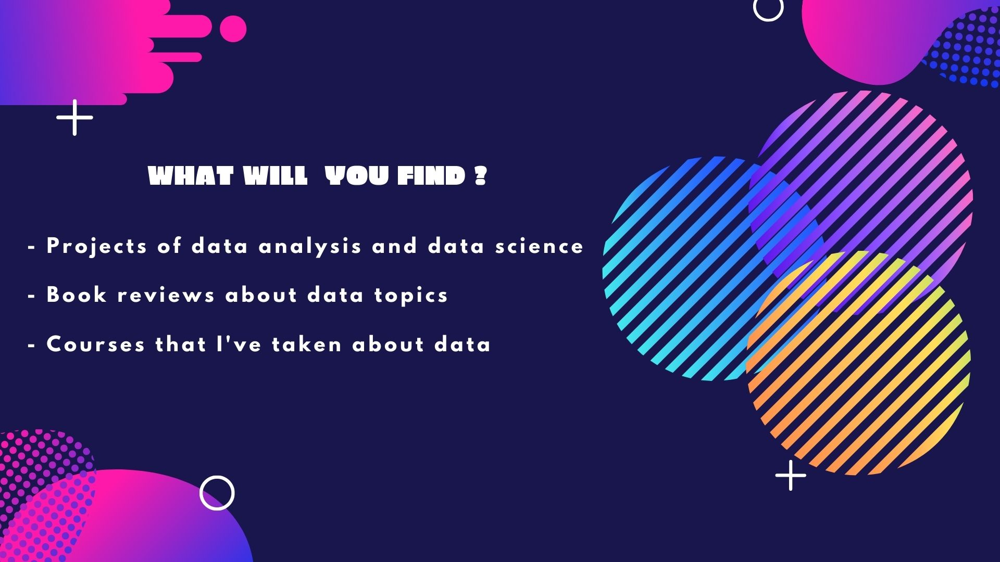
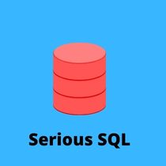

# Welcome to my Data Analyst / Data Scientist Portfolio  :octocat:

 

🏅I'm a data enthusiast with a lot of experience in numerical analysis due to my academic career as chemical engineer .

⚡🔥 My Goal is to simplify the life of the people  through tha analysis of their information , this information are 
 data that can be used in many ways with the purpose of describe , prescribe , modelate and predict events related to a specific topic .
 
 
 

---

🔥 In terms of content this portfolio will be in constant update and you can find my projects , reviews and current activities .
🔥 The main tools that I'm gonna cover in a short term period will be 
 
 

 
 
 
 

### Contact 

### Now you are free to explore my projects 👇 just click on any of this images 

